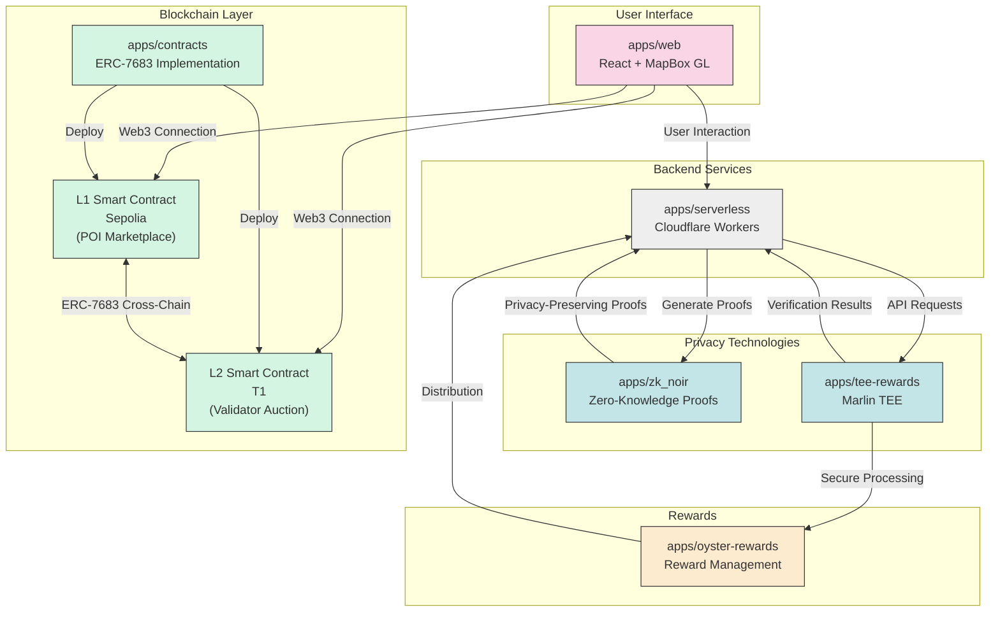

<div align="center">
<h1>OrbitalMap</h1>

<p> OrbitalMap is a privacy-focused, web3 mapping platform that combines Zero-Knowledge proofs, Trusted Execution Environments (TEEs), and ERC-7683 smart contracts to create a secure and private geospatial experience.</p>

</img>

[](./LICENSE)
</div>

OrbitalMap is a privacy-focused, web3 mapping platform that combines Zero-Knowledge proofs, Trusted Execution Environments (TEEs), and ERC-7683 smart contracts to create a secure and private geospatial experience.

## Project Structure

The project is organized as a Turborepo monorepo with the following components:

### Apps

- **web**: The main frontend application built with React, Vite, and MapBox
- **serverless**: Cloudflare Workers-based API backend
- **zk_noir**: Zero-Knowledge proof circuits using Noir language
- **tee-rewards**: Marlin TEE for secure reward generation and location verification
- **contracts**: ERC-7683 smart contracts for cross-chain bidding and verification

### Key Technologies

- **Frontend**: React 19, TypeScript, Vite, MapBox GL
- **Backend**: Cloudflare Workers, Hono, OpenAPI
- **Privacy Tech**: Noir ZK proofs, Marlin TEE for secure computations
- **Authentication**: Privy for web3 authentication
- **Smart Contracts**: ERC-7683 implementation for cross-chain POI marketplace

## Features

OrbitalMap offers the following key features:

- **Interactive Map Interface**: Explore and interact with a privacy-preserving map.
- **Privacy-Preserving Location Sharing**: Share location data with Zero-Knowledge proofs.
- **Web3 Authentication**: Secure login with blockchain-based identity.
- **POI Marketplace**: Register and validate Points of Interest using ERC-7683 contracts.
- **TEE-Secured Rewards**: Earn rewards through secure Marlin TEE-validated interactions.

## ERC-7683 Smart Contracts

Our project implements a Trusted POI (Point of Interest) Marketplace using ERC-7683 for cross-chain bidding and verification between L1 (Sepolia) and L2 (T1).

### Contract Features

- **POI Registration with staking on L1**: Register locations with a stake to ensure quality.
- **Cross-chain validator auction on L2**: Validators bid to verify POIs through L1-L2 communication.
- **TEE+ZK Proof for POI verification**: Combine Trusted Execution Environments with Zero-Knowledge proofs for secure verification.
- **Challenge mechanism**: Contest incorrect POIs to maintain data quality.
- **Reward distribution**: Validators earn rewards for accurate verifications.

### Architecture

The POI Marketplace consists of two main contracts:

1. **L1POIMarketplace (Sepolia)**: Handles POI registration, staking, and validation results.
2. **L2POIAuction (T1)**: Manages validator auctions and proof verification using TEE+ZK.

Cross-chain communication is facilitated through ERC-7683 standard.

## Marlin TEE Implementation

Our Trusted Execution Environment runs on Marlin and provides the following secure services:

### Secure Location Services

- **Private Location Encryption & Decryption**: Process location data securely within the TEE using asymmetric cryptography.
- **Anti-Spoofing Protection**: Validate location authenticity by verifying GPS data against known WiFi networks and cell towers.
- **Secure Privacy-Preserving Heatmaps**: Generate anonymized location analytics without revealing individual user data.
- **Anonymous Location Analytics**: Provide visit metrics while protecting user privacy.

### TEE Security Guarantees

- All sensitive operations (encryption, decryption, verification) happen only within the TEE
- Location data never leaves the secure enclave in unencrypted form
- Computational integrity is guaranteed by the TEE's hardware-level isolation

## Zero-Knowledge Proofs

Our ZK proofs built with Noir enable privacy-preserving verification mechanisms:

- **Proof of Visit**: Prove location visits without revealing exact coordinates
- **Reputation Proofs**: Verify reputation metrics without disclosing specific values
- **Ownership Proofs**: Confirm asset ownership without revealing identifiers
- **Trustless Commitments**: Enable peer-to-peer task verification
- **Local Explorer Badge**: Earn badges based on multiple location visits

## Getting Started

### Prerequisites

- Node.js 18+
- Bun 1.2.5+ (package manager)

### Installation

1. Clone the repository:
   ```
   git clone https://github.com/kidneyweakx/orbitalmap.git
   cd orbitalmap
   ```

2. Install dependencies:
   ```
   bun install
   ```

3. Set up environment variables:
   - Copy `.env.example` to `.env` in the `apps/web` directory
   - Copy `.dev.vars.example` to `.dev.vars` in the `apps/serverless` directory (if available)

### Running the Development Environment

To start all services in development mode:

```
bun dev
```

To run specific applications:

```
# Frontend
cd apps/web
bun dev

# Serverless backend
cd apps/serverless
bun dev

# Deploy contracts
cd apps/contracts
bun run deploy:all
```

## Architechure


## License

This project is licensed under the LGPL LICENSE
